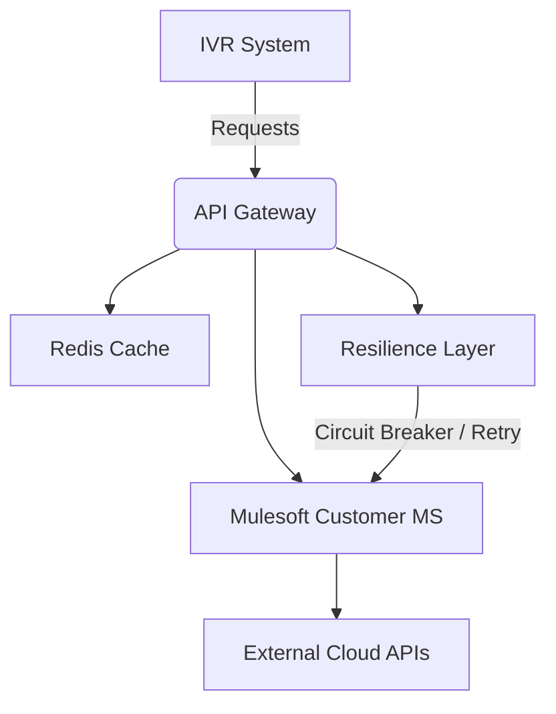

<p align="center">
  <a href="http://nestjs.com/" target="blank"></a>
</p>

# 🧩 api-ivr-mdw

**api-ivr-mdw** es un *middleware* desarrollado para integrar sistemas IVR (*Interactive Voice Response*) con servicios corporativos en la nube mediante una arquitectura de **microservicios escalables y resilientes**.

Su propósito es **conectar, orquestar y asegurar la comunicación** entre múltiples APIs externas (como Mulesoft, Redis, y servicios internos), garantizando tolerancia a fallos y estabilidad ante errores o latencias de red mediante un completo **motor de resiliencia**.

---

## 🚀 Características principales

- **Arquitectura modular (NestJS monorepo):** apps independientes como `api-gateway`, `mulesoft-customer-ms`, y librerías compartidas (`auth-client`, `redis-client`, `resilience`, `xml`, etc.).  
- **Resilience Layer integrada:** circuit breaker, retry, timeout, backoff, y manejo de errores no reintentables.  
- **Integración con Mulesoft APIs:** permite gestionar información de clientes (por ANI o DNI) y otros procesos IVR.  
- **Cache distribuido con Redis:** para almacenamiento temporal de tokens, respuestas y estados de circuitos.  
- **Orquestación en Docker Swarm:** despliegue automatizado multiambiente (`dev`, `preprod`, `prod`) con **Traefik v3** como reverse proxy.  
- **Observabilidad completa:** métricas y dashboards vía **Prometheus**, **Grafana** y **Dynatrace**.  

---

## 🏗️ Arquitectura general



---

## ⚙️ Instalación

```bash
# Clonar el repositorio
git clone https://gitlab.com/telecom-argentina/cio/canalesdigitales/pic/backend/ivr-evolution/api-ivr-mdw.git
cd api-ivr-mdw

# Instalar dependencias (usa pnpm para monorepos)
pnpm install

# Iniciar entorno de desarrollo local - 1 terminal para cada app
pnpm run start:dev (app)
pnpm run start:dev api-gateway
pnpm run start:dev mulesoft-customer-ms

```
---

## 🐳 Despliegue en Docker Swarm localmente

El proyecto está diseñado para ejecutarse dentro de un **cluster Swarm** con balanceo y TLS vía **Traefik**.

Es requisito tener instalado Docker Desktop (Windows) o docker

```bash
# Iniciar el swarm
docker swarm init

# Desplegar stack
cd deploy
docker stack deploy -c docker-stack.yml api-ivr-mdw
```

> Dentro de deploy en necesario crear un archivo de variables de entorno (`.env`)

---

## 🐳 Despliegue en Docker Compose localmente

El proyecto puede ejecutarse alternativamente mediante docker compose

Es requisito tener instalado Docker Desktop (Windows) o docker

```bash
# Desplegar en compose
cd deploy
docker compose up -d
```

> Dentro de deploy en necesario crear un archivo de variables de entorno (`.env`)
---

## 🧠 Resilience Layer

El módulo de resiliencia gestiona automáticamente fallos temporales mediante:

- **Circuit Breaker:** evita cascadas de errores cuando un servicio externo falla repetidamente.  
- **Retry con Backoff exponencial:** reintenta operaciones de forma controlada.  
- **Timeouts configurables:** limita tiempos de espera por servicio.  
- **Fallback opcional:** permite definir respuestas por defecto ante errores.  

---

## 📊 Observabilidad (WIP)

Cada microservicio expone un endpoint `/metrics` compatible con **Prometheus**.  
El stack puede integrarse fácilmente con **Grafana** o **Dynatrace** para análisis en tiempo real.

---

## 🧩 Estructura del repositorio

```
apps/
  ├─ api-gateway/
  ├─ mulesoft-customer-ms/
libs/
  ├─ auth-client/
  ├─ redis-client/
  ├─ resilience/
  ├─ xml/
  └─ common/
```

---

## 🤝 Contribuciones

1. Forkeá el repo  
2. Creá una rama de feature (`feat/nueva-funcionalidad`)  
3. Hacé commit claro y semántico  
4. Abrí un Pull Request  

---

## 📜 Licencia

Este proyecto está bajo la licencia **MIT**.  
© 2025 [Christian Cardozo](https://github.com/Christian-Cardozo)
